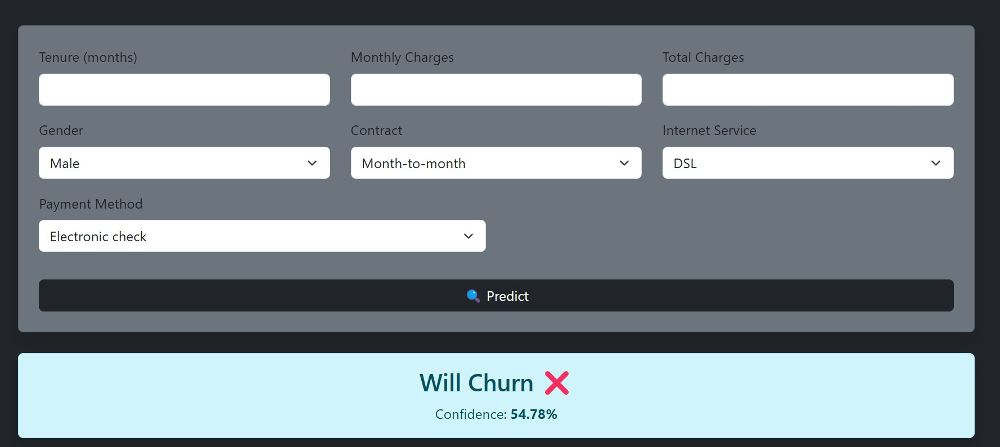
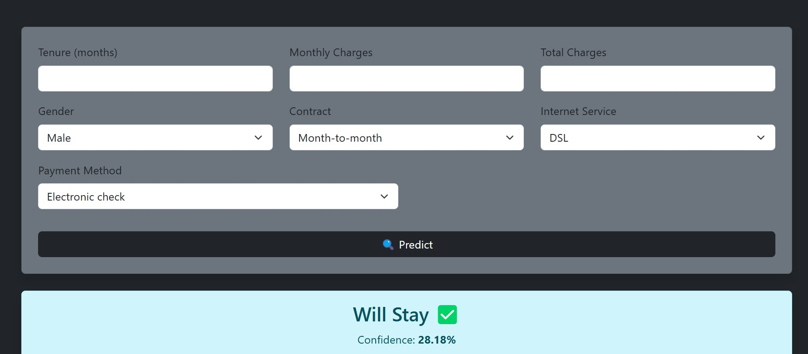

#  Customer Churn Prediction System

##  Overview
End-to-end machine learning system to predict customer churn using real-world telecom data.

---

##  ML Model
- Algorithm: Logistic Regression
- Accuracy: **81%**
- Preprocessing:
  - Standard Scaling
  - One-Hot Encoding

---

## Features
- Django web interface
- FastAPI + Django REST API
- Real-time predictions
- Probability output

---

## Tech Stack
- Python
- Scikit-learn
- Django
- FastAPI
- Pandas / NumPy

---

## Demo

---

##  How to Run

### 1. Clone repo
bash
git clone https://github.com/osamajmt/customer-churn-prediction.git
cd customer-churn-prediction

### 2. Install dependencies
pip install -r requirements.txt

### 3. Run Django
python manage.py runserver

---

##  API Example
POST `/predict`

 json
{
  "tenure": 12,
  "MonthlyCharges": 70,
  "TotalCharges": 840,
  "gender": "Male"
}